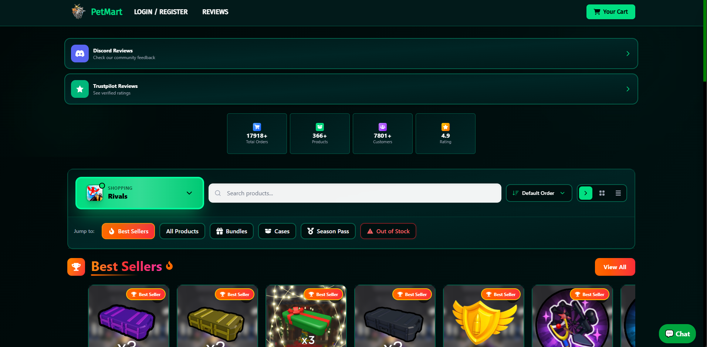
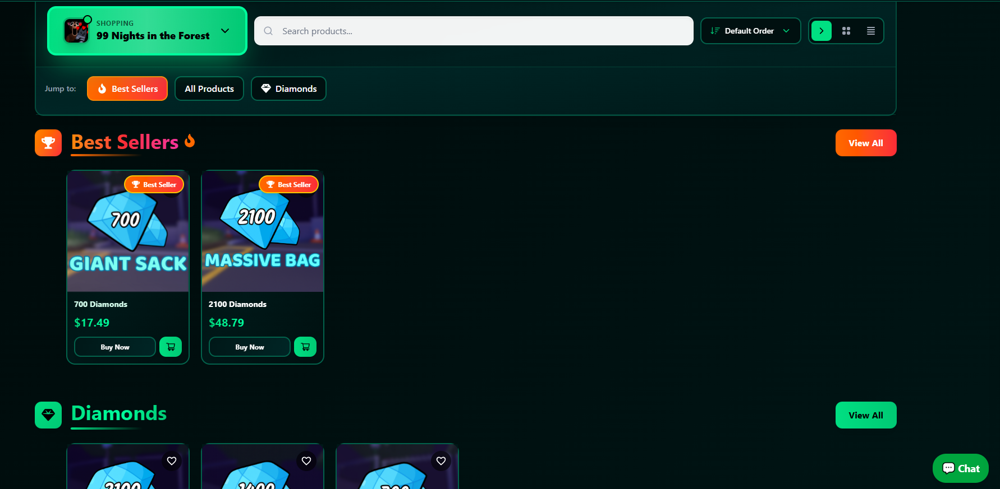
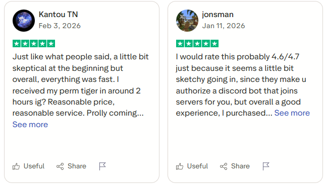
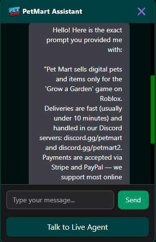
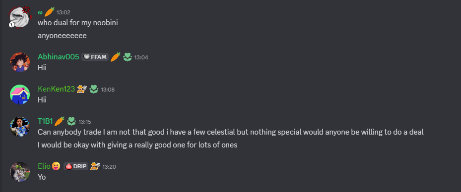
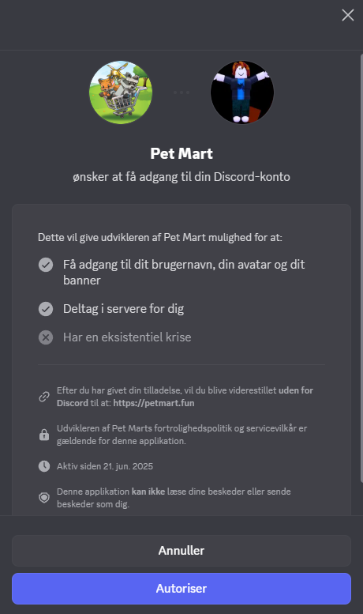

# PetMart.fun – Information & Safety Analysis

This page documents publicly visible information about **PetMart.fun** and explains why services like this are risky for Roblox players.

---

## Basic Information

**Website:**  
- https://petmart.fun

**Discord servers:**  
- discord.gg/petmart  
- discord.gg/petmart2  

**What they sell:**  
- Roblox pets  
- Gems and in-game currency  
- Permanent or time-limited items  

**Delivery method:**  
- Discord-based delivery  
- Automated and manual bot systems  

**Payment methods claimed:**  
- PayPal  
- Stripe  

---

## How the Service Works

1. A user buys an item on the website  
2. The user is sent to a Discord server  
3. A bot or staff member delivers the item in-game  
4. Support and disputes are handled in Discord  

This setup is common for **unofficial Roblox marketplaces**.

---

## Why This Is Risky

### Against Roblox Rules
Roblox does not allow:
- Off-platform sales of items  
- Real-money trading for pets or gems  
- Third-party marketplaces  

Using services like this can result in:
- Items being removed later  
- Account warnings or bans  

---

### Discord-Based Shops

Discord shops are risky because:
- Servers can be deleted without notice  
- Owners can rebrand easily  
- There is no buyer protection system  

---

### Reviews and Ratings

The site shows very high ratings, but:
- Reviews use similar wording  
- Many follow the same structure  
- Trustpilot does not verify Roblox trades  

Ratings do not guarantee safety.

---

### Bot Security Issues

The PetMart Discord bot was able to reveal its system prompt when asked.

This shows:
- Weak bot security  
- No owner verification  
- Poor access control  

Bots like this may mishandle user data.

---

## Who Is Most Affected

Players most at risk include:
- Children  
- Parents buying items for kids  
- New or young Roblox users  

Even if an item is delivered, it may not stay permanently.

---

## How to Avoid Services Like This

- Only buy items inside Roblox  
- Avoid Discord-based item shops  
- Never authorize unknown bots  
- Enable 2-step verification  
- Be cautious of “fast delivery” promises  

If a service requires Discord to complete a purchase, it is likely unsafe.

---

## Summary

PetMart.fun:
- Is not affiliated with Roblox  
- Operates outside Roblox rules  
- Uses Discord for delivery and support  
- Relies on ratings that do not verify safety  

Players should avoid third-party Roblox marketplaces to protect their accounts and money.
